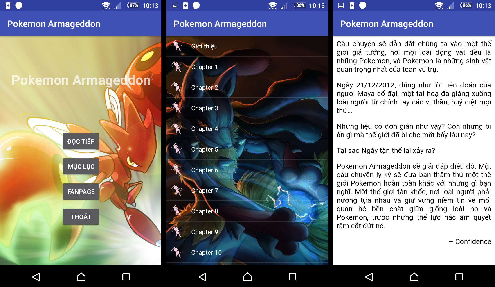

# Pokemon Armageddon

An interesting story about Pokemon.

The original public at: [Pokemon Armageddon](https://confidencewriter.wordpress.com/pokemon-armageddon/)

Fanpage: [Pokémon Theorists Việt Nam](https://www.facebook.com/PokemonTheoristsVN/)

I wrote this project just to learn Android as a beginner.
You can download and use this project for any purpose, it's free.

## Use

You can crawl data by [crawl\_data.py](crawl_data.py) script. It will generate _pokemon\_armageddon.db_ file as Android SQlite data.

Open the project with your Android Studio.

## Screenshot

